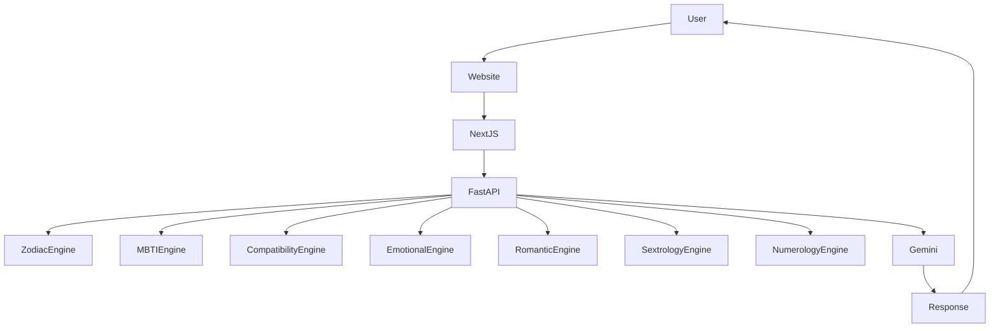

<p align="center">
  <h1 align="center">ZodicogAI</h1>
  <p align="center">
    Hybrid Zodiac + MBTI Relationship Intelligence Platform
  </p>
</p>

<p align="center">
  
  
  
  
</p>

---

# ZodicogAI — Hybrid Behavioral Intelligence Platform

**ZodicogAI** is a full-stack relationship intelligence platform that analyzes personality, compatibility, intimacy dynamics, and attachment behavior using a hybrid system combining **astrology archetypes, MBTI typology, deterministic behavioral modeling, and AI synthesis**.

The platform powers **Zodicognac**, an AI coaching agent capable of interpreting personality patterns and offering contextual insights for relationships and social interactions.

---

# 🌐 Live Demo

**https://zodicogai.com**

---

# 🧠 System Architecture

ZodicogAI follows a **hybrid deterministic + AI reasoning architecture**.

Deterministic engines compute structured behavioral metrics, which are interpreted through an AI reasoning layer powered by Gemini.



---

# 🧪 Behavioral Intelligence Model

ZodicogAI is built around a **hybrid behavioral modeling framework** combining symbolic personality systems with deterministic compatibility computation.

### 1. Archetypal Layer

Symbolic personality systems define baseline behavioral patterns.

Frameworks used include:

- Zodiac archetypes (element, modality, decan)
- MBTI cognitive function stacks
- Classical love style theory
- Love language preference models
- Pythagorean numerology

These frameworks define structured personality attributes used for analysis.

---

### 2. Deterministic Modeling Layer

Personality traits are transformed into structured vectors and compatibility matrices.

Examples include:

- element affinity tables
- modality interaction matrices
- personality trait similarity vectors
- emotional responsiveness scoring
- romantic polarity balancing

Compatibility scores are computed using weighted multi-dimension models.

---

### 3. Generative Interpretation Layer

Deterministic outputs are passed to an AI reasoning layer powered by **Gemini**.

The model synthesizes:

- personality narratives
- compatibility explanations
- coaching suggestions
- behavioral interpretations

This ensures that responses remain **grounded in structured data rather than purely generative output**.

---

# 🧭 Design Principles

ZodicogAI is designed around several principles that make the system interpretable and extensible.

### Deterministic Grounding

Compatibility scoring is computed using deterministic engines rather than AI generation.
This ensures results are:

- reproducible
- explainable
- consistent

AI is used only for interpretation and narrative synthesis.

---

### Hybrid Intelligence

The platform combines two complementary layers:

**Symbolic Modeling**

- astrology archetypes
- personality typologies
- compatibility matrices
- behavioral vectors

**Generative Reasoning**

- conversational explanations
- coaching insights
- narrative synthesis

---

### Modular Engine Architecture

Each behavioral domain is implemented as an independent engine module.

Examples include:

- zodiac_engine
- mbti_engine
- emotional_engine
- romantic_engine
- sextrology_engine
- numerology_engine

This modular architecture allows the system to evolve as new models are introduced.

---

### Multi-Dimensional Compatibility

Rather than producing a single compatibility score, ZodicogAI evaluates relationships across multiple behavioral dimensions including:

- emotional alignment
- romantic chemistry
- behavioral similarity
- intimacy dynamics
- communication style

The final compatibility score is a **weighted synthesis of multiple interaction layers**.

---

# ✨ Core Features

## Individual Personality Analysis

### Zodiac Profile

- Sun sign interpretation
- Element classification (Fire, Earth, Air, Water)
- Modality analysis (Cardinal, Fixed, Mutable)
- Decan personality nuance
- Archetypal trait mapping

---

### MBTI Typology

- 16 personality types
- Cognitive function stacks
- Behavioral communication patterns
- Social interaction styles

---

### Hybrid Personality Synthesis

Zodiac archetypes and MBTI cognition combine into a **unified behavioral profile**.

Outputs include:

- trait radar charts
- behavioral axis maps
- psychological summaries

---

### Color Analysis

Symbolic aura color interpretation derived from zodiac archetypes including:

- personality color mapping
- attraction energy palettes
- emotional resonance colors

---

### Numerology

Pythagorean numerology calculations including:

- Life Path Number
- Expression Number
- Personality Number

---

# ❤️ Compatibility Analysis (8 Dimensions)

ZodicogAI evaluates relationships across eight behavioral dimensions.

1. **Zodiac Compatibility**
   Element affinity, modality synergy, archetype similarity.

2. **Behavioral Compatibility**
   Personality trait similarity derived from zodiac and MBTI vectors.

3. **Emotional Compatibility**
   Attachment responsiveness and emotional expression alignment.

4. **Romantic Compatibility**
   Passion intensity, affection pacing, polarity balance.

5. **Intimacy Compatibility**
   Sexual archetypes and intimacy dynamics.

6. **Love Style Alignment**
   Eros, Storge, Ludus, Mania, Pragma, Agape interaction mapping.

7. **Love Language Alignment**
   Words, acts, gifts, time, touch preference compatibility.

8. **Numerology Compatibility**
   Life path and expression number synergy.

---

# 🤖 Zodicognac AI Coaching

Zodicognac acts as the conversational intelligence layer.

User questions are classified into relationship coaching intents and routed to the appropriate engines.

Supported coaching scenarios include:

- Signal interpretation
- First date guidance
- Red flag / green flag analysis
- Reconnection strategies
- Attachment style coaching
- Relationship progression advice

---

# 📊 Visualization System

The frontend includes interactive visualizations such as:

- Trait radar charts
- Compatibility score rings
- Metric cards
- Behavioral axis maps
- Love language comparisons
- Love style comparisons

Animations are implemented using **Framer Motion** for progressive analysis reveals.

---

# 🏗 Tech Stack

## Frontend

- Next.js
- React
- Tailwind CSS
- Framer Motion
- Recharts
- TypeScript

---

## Backend

- FastAPI
- Python 3.10+
- Pydantic v2
- Uvicorn

---

## AI Layer

- Google Gemini 2.5 Flash

Gemini is invoked only from the **backend layer** to keep API keys secure.

---

# 🧮 Deterministic Analysis Engines

The backend contains modular engines responsible for analysis.

```
zodiac_engine.py
mbti_engine.py
compatibility_engine.py
emotional_engine.py
romantic_engine.py
sextrology_engine.py
love_style_engine.py
love_language_engine.py
color_engine.py
numerology_engine.py
decan_engine.py
relationship_intelligence_engine.py
```

Each engine computes structured personality or compatibility data used by the AI layer.

---

# 🔌 API Example

Example compatibility request:

```bash
curl -X POST http://localhost:8000/analyze/compatibility \
-H "Content-Type: application/json" \
-d '{
  "person_a": {
    "name": "Alice",
    "zodiac": "Leo",
    "mbti": "ENFJ"
  },
  "person_b": {
    "name": "Bob",
    "zodiac": "Scorpio",
    "mbti": "INTJ"
  }
}'
```

Example response:

```json
{
  "overall_score": 82,
  "emotional_score": 76,
  "romantic_score": 85,
  "analysis": "Leo and Scorpio often create an intense attraction dynamic with strong emotional polarity."
}
```

---

# 🔧 Extending the Engine System

ZodicogAI is designed to be modular and extensible.

New behavioral engines can be added to expand the system.

### Example Engine

```python
def analyze_example(person_a, person_b):
    score = compute_score(person_a, person_b)

    return {
        "score": score,
        "interpretation": "Example compatibility insight"
    }
```

---

### Register the Engine

Engines are registered inside the engine registry:

```
_ENGINE_REGISTRY = {
    "zodiac": zodiac_engine.analyze,
    "mbti": mbti_engine.analyze,
    "example": example_engine.analyze
}
```

---

### Extend Pipelines

Pipelines define how engines combine into a full analysis.

```
_PIPELINE_REGISTRY = {
    "COMPATIBILITY_ANALYSIS": [
        "zodiac",
        "emotional",
        "romantic",
        "example"
    ]
}
```

---

# 🚀 Local Development

## Prerequisites

- Python 3.10+
- Node.js 18+
- Gemini API key from Google AI Studio

---

## Backend Setup

```
cd backend
python -m venv venv
source venv/bin/activate
pip install -r requirements.txt
uvicorn main:app --reload
```

Backend runs at:

```
http://localhost:8000
```

---

## Frontend Setup

```
cd frontend
npm install
npm run dev
```

Frontend runs at:

```
http://localhost:3000
```

---

# 🧪 Testing

Run backend tests:

```
cd backend
pytest tests/ -v
```

---

# 🚢 Deployment

Typical production architecture:

```
Internet
 ↓
zodicogai.com
 ↓
Nginx
 ↓
Next.js frontend
 ↓
FastAPI backend
 ↓
Gemini API
```

Recommended production components:

- Ubuntu Linux
- Nginx
- Node.js
- Python
- Uvicorn
- PM2
- Let's Encrypt SSL

---

# ⚠️ Limitations & Responsible Use

ZodicogAI is designed as a **behavioral reflection tool**, not a predictive or diagnostic system.

The platform incorporates symbolic personality frameworks including:

- astrology archetypes
- MBTI personality typology
- numerology
- classical relationship theories

These systems are widely used for self-reflection but are **not scientifically validated psychological assessments**.

AI-generated interpretations may simplify complex interpersonal dynamics.
Users should treat insights as **reflective guidance rather than factual conclusions**.

ZodicogAI does not provide:

- psychological diagnosis
- therapy
- medical advice
- professional counseling

Users experiencing serious relationship or mental health challenges should consult qualified professionals.

---

# 🤝 Contributing

Contributions are welcome.

Guidelines:

- Use TypeScript on the frontend
- Use Python type hints on the backend
- Write tests for new engines
- Update documentation when adding features

---

# 📝 License

MIT License

---

# 🔮 Philosophy

ZodicogAI explores how archetypal personality systems can interact with modern AI reasoning to illuminate patterns in human relationships.

By combining symbolic behavioral models with generative AI interpretation, the platform aims to provide tools for **self-reflection, relational awareness, and curiosity about interpersonal dynamics**.

Built with modern AI and behavioral modeling.
