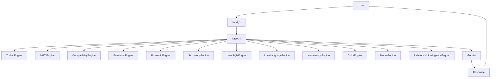

<p align="center">
  <h1 align="center">ZodicogAI</h1>
  <p align="center">
    Hybrid Zodiac + MBTI Relationship Intelligence Platform
  </p>
</p>

<p align="center">
  
  
  
  
  
</p>

---

**ZodicogAI** is a full-stack relationship intelligence platform that analyzes personality, compatibility, intimacy dynamics, and attachment behavior using a hybrid system combining **astrology archetypes, MBTI typology, deterministic behavioral modeling, and AI synthesis**.

The platform powers **Zodicognac** — an AI coaching agent grounded in real personality data, capable of interpreting behavioral patterns and offering contextual relationship coaching across 15 distinct intent categories.

---

## Live

**https://zodicogai.com** · Contact: kar1mr@zodicogai.com

---

## System Architecture

ZodicogAI follows a **hybrid deterministic + AI reasoning architecture**. Deterministic engines compute structured behavioral metrics, which are passed to Gemini for narrative synthesis.

```
User → Next.js Frontend → FastAPI Backend → Deterministic Engines → Gemini → Response
```



---

## Dual Layout Design

ZodicogAI has intentionally distinct desktop and mobile experiences:

| | Desktop | Mobile |
|---|---|---|
| **Feel** | Analytical intelligence platform | Personal AI companion |
| **Navigation** | Top navbar with all analysis pages | Bottom tab bar (5 tabs + center FAB) |
| **Layout** | Data-dense dashboard | Card-based storytelling |
| **Chat sidebar** | Persistent profile panel | Bottom sheet (slides up) |
| **Zodicognac entry** | Pill button in top-right | Raised amber FAB in tab bar |

---

## Features

### Individual Analysis

| Feature | Description |
|---|---|
| **Zodiac Profile** | Sun sign, element, modality, decan nuance, archetypal trait mapping |
| **MBTI Analysis** | 16 types, cognitive function stacks, behavioral patterns |
| **Hybrid Profile** | Combined zodiac + MBTI behavioral synthesis with trait radar + behavioral axis map |
| **Aura Colors** | Zodiac-derived color personality mapping, love energy palettes, power colors |
| **Numerology** | Life Path, Expression, Lucky numbers via Pythagorean system |

### Pair / Compatibility Analysis

| Dimension | What It Measures |
|---|---|
| **Zodiac Compatibility** | Element affinity, modality synergy, archetype similarity |
| **Behavioral Compatibility** | Personality trait vector similarity |
| **Emotional Compatibility** | Attachment responsiveness, emotional expression alignment |
| **Romantic Compatibility** | Passion intensity, affection pacing, polarity balance |
| **Intimacy / Sextrology** | Sexual archetypes, erogenous focus, bedroom dynamics |
| **Love Style Alignment** | Eros / Storge / Ludus / Mania / Pragma / Agape interaction matrix |
| **Love Language Alignment** | Words / Acts / Gifts / Time / Touch preference compatibility |
| **Numerology Compatibility** | Life path and expression number synergy with pursue/avoid signal |
| **Aura Color Harmony** | Color blend, middle-ground, and complementary color computation |
| **Full Synastry** | Weighted synthesis across all dimensions |

---

## Zodicognac — AI Coaching Agent

Zodicognac classifies user questions into relationship coaching intents and routes them to the appropriate engine data + prompt template.

**15 supported intent categories:**

| Intent | Description |
|---|---|
| `personality_analysis` | Trait breakdown for a specific person |
| `compatibility_question` | Direct compatibility questions |
| `relationship_advice` | Warm, constructive relationship guidance |
| `flirting_guidance` | Personality-specific attraction strategies |
| `communication_help` | Style-gap analysis and communication techniques |
| `sextrology` | Intimate compatibility and bedroom dynamics |
| `signal_reading` | Decode whether someone is interested |
| `first_date_coaching` | Venue, conversation, first impression strategy |
| `red_flags_green_flags` | Sign/MBTI-specific warning and investment signals |
| `getting_them_back` | Re-approach strategy tailored to personality type |
| `attachment_style_coaching` | Anxious/avoidant/secure dynamic mapping |
| `commitment_progression` | Moving from casual to serious, type-specific |
| `numerology_question` | Numerology-grounded relationship questions |
| `color_question` | Aura color personality questions |
| `general_question` | Catch-all relationship and personality questions |

Responses are formatted as structured markdown (headings, bullets, bold terms) and rendered with custom inline markdown parsing — no external markdown library required.

---

## Tech Stack

### Frontend
- **Next.js 16** (App Router, Turbopack)
- **React 19**
- **TypeScript**
- **Tailwind CSS v4**
- **Framer Motion** — page transitions, progressive reveal, sheet animations
- **Recharts 3** — trait radar charts, scatter behavioral maps

### Backend
- **FastAPI**
- **Python 3.10+**
- **Pydantic v2** — request/response schema validation
- **Uvicorn**
- **google-genai SDK** — Gemini 2.5 Flash (primary) + Gemini 2.0 Flash Lite (fallback)

---

## Engine Modules

```
backend/engines/
  zodiac_engine.py                  Sun sign, element, modality, traits
  mbti_engine.py                    Cognitive function stacks, type profiles
  decan_engine.py                   Decan sub-ruler, keywords, rich description
  compatibility_engine.py           Vector similarity, element/modality matrices
  emotional_engine.py               Attachment responsiveness scoring
  romantic_engine.py                Passion intensity, polarity balance
  sextrology_engine.py              Sexual archetype compatibility
  love_style_engine.py              Eros/Storge/Ludus/Mania/Pragma/Agape matrix
  love_language_engine.py           Love language preference compatibility
  color_engine.py                   Zodiac color mapping, HSL harmony computation
  numerology_engine.py              Pythagorean life path + expression numbers
  relationship_intelligence_engine.py  Full synastry weighted synthesis
```

---

## API Endpoints

```
POST /analyze/zodiac              Single zodiac + MBTI hybrid profile
POST /analyze/emotional           Emotional compatibility (pair)
POST /analyze/romantic            Romantic compatibility (pair)
POST /analyze/sextrology          Intimacy/sexual compatibility (pair)
POST /analyze/love-style          Love style alignment (single or pair)
POST /analyze/love-language       Love language alignment (single or pair)
POST /analyze/color               Aura color (single or pair)
POST /analyze/numerology          Numerology (single or pair)
POST /dashboard                   Full synastry across all dimensions
POST /chat                        Zodicognac conversational AI
POST /compatibility               Behavioral compatibility score
```

**Example — Romantic Compatibility:**

```bash
curl -X POST https://zodicogai.com/analyze/romantic \
  -H "Content-Type: application/json" \
  -d '{
    "person_a_name": "Alice",
    "person_a_day": 14,
    "person_a_month": 8,
    "person_a_mbti": "ENFJ",
    "person_b_name": "Bob",
    "person_b_day": 3,
    "person_b_month": 11,
    "person_b_mbti": "INTJ"
  }'
```

**Example — Zodicognac Chat:**

```bash
curl -X POST https://zodicogai.com/chat \
  -H "Content-Type: application/json" \
  -d '{
    "message": "Does he actually like me or is he just keeping me around?",
    "person_a": { "name": "Alice", "day": 14, "month": 8, "mbti": "ENFJ", "gender": "F" },
    "person_b": { "name": "Bob", "day": 3, "month": 11, "mbti": "INTJ", "gender": "M" },
    "history": []
  }'
```

---

## Local Development

### Prerequisites
- Python 3.10+
- Node.js 18+
- Gemini API key from [Google AI Studio](https://aistudio.google.com)

### Backend

```bash
cd backend
python -m venv venv
source venv/bin/activate          # Windows: venv\Scripts\activate
pip install -r requirements.txt

# Create .env
echo "GEMINI_API_KEY=your_key_here" > .env

uvicorn main:app --reload --host 0.0.0.0 --port 8000
```

Backend: `http://localhost:8000`

### Frontend

```bash
cd frontend
npm install
npm run dev
```

Frontend: `http://localhost:3000`

---

## Production Deployment

```
Internet → Nginx (SSL) → Next.js (port 3000) → FastAPI (port 8000) → Gemini API
```

**Recommended stack:**
- Ubuntu Linux VPS
- Nginx + Let's Encrypt SSL
- PM2 for Next.js process management
- Uvicorn (no `--reload`) for FastAPI

**Backend start (production):**
```bash
cd backend && venv/Scripts/uvicorn main:app --host 0.0.0.0 --port 8000
```

**Backend restart (Windows, clears stale processes):**
```bash
python3 -c "import subprocess; subprocess.run(['taskkill', '/IM', 'python.exe', '/F'])"
find backend -name '__pycache__' -type d -exec rm -rf {} +
cd backend && venv/Scripts/uvicorn.exe main:app --host 0.0.0.0 --port 8000
```

---

## Extending the Engine System

Engines are registered in `backend/agent_controller.py`:

```python
_ENGINE_REGISTRY = {
    "zodiac": zodiac_engine.analyze,
    "mbti": mbti_engine.analyze,
    "my_new_engine": my_engine.analyze,
}

_PIPELINE_REGISTRY = {
    "MY_NEW_ANALYSIS": ["zodiac", "mbti", "my_new_engine"],
}
```

Add a matching prompt template in `backend/chat/prompt_templates.py` and register it in `_TEMPLATES`.

---

## Limitations & Responsible Use

ZodicogAI is designed as a **behavioral reflection tool**, not a predictive or diagnostic system.

The platform incorporates symbolic personality frameworks — astrology, MBTI, numerology, classical relationship theories — which are widely used for self-reflection but are **not scientifically validated psychological assessments**.

AI-generated interpretations may simplify complex interpersonal dynamics. Treat insights as **reflective guidance, not factual conclusions**.

ZodicogAI does not provide psychological diagnosis, therapy, medical advice, or professional counseling. Users experiencing serious relationship or mental health challenges should consult qualified professionals.

---

## License

MIT

---

## Philosophy

ZodicogAI explores how archetypal personality systems can interact with modern AI reasoning to illuminate patterns in human relationships. By combining symbolic behavioral models with generative AI interpretation, the platform aims to provide tools for self-reflection, relational awareness, and curiosity about interpersonal dynamics.
